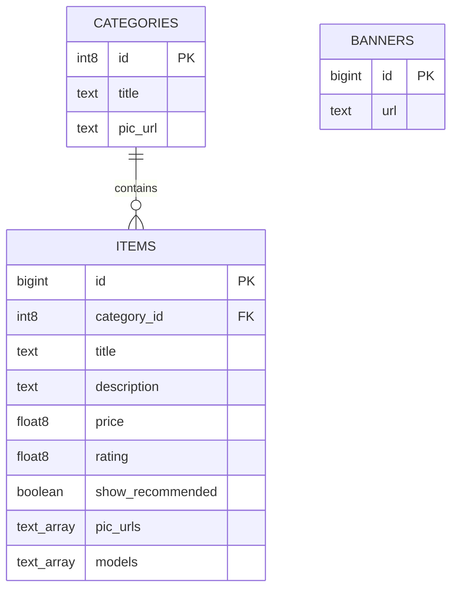

# Database Schema Diagram

This diagram visualizes the relational structure for the Supabase database.

```mermaid
erDiagram
    CATEGORIES ||--o{ ITEMS : "contains"
    CATEGORIES {
        int8 id PK
        text title
        text pic_url
    }
    ITEMS {
        bigint id PK
        int8 category_id FK
        text title
        text description
        float8 price
        float8 rating
        boolean show_recommended
        text_array pic_urls
        text_array models
    }
    BANNERS {
        bigint id PK
        text url
    }
```
